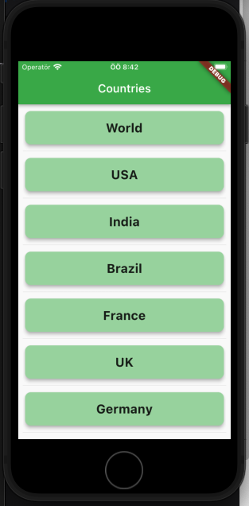

# Covid Tracking

Covid status tracking application with Flutter

## Features
 - BLoC
 - Dio
 - Clean Architecture
 - AutoRoute
 - Unit, Widget tests

## TODO
 - Add more tests
 - Improve design

## Screenshots

<table>
    <tr>
        <td></td>
        <td></td>
    </tr>
</table>